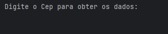
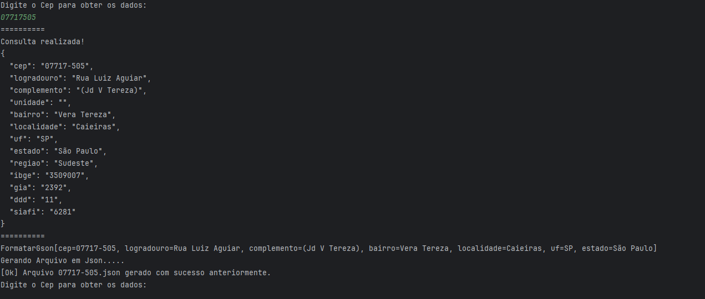
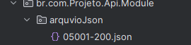
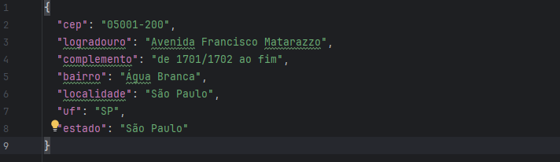

# Consulta CEP – API ViaCEP (Java)

Este projeto foi desenvolvido em Java com o objetivo de consumir a API pública ViaCEP, converter a resposta JSON usando Gson e salvar os dados formatados em um arquivo `.json`.

A aplicação utiliza:

- `HttpClient` para fazer requisições HTTP  
- `Gson` para conversão entre JSON ↔ objeto  
- `Records` para mapear os dados recebidos  
- Escrita de arquivos para salvar o resultado da consulta  
- Tratamento básico de exceções

---

## 🛠 Tecnologias utilizadas

- Java 17+  
- Gson  
- HttpClient (Java nativo)  
- IntelliJ IDEA  
- Git + GitHub  

---

## ▶️ Como funciona

1. O usuário informa um CEP no console  
2. O programa monta a URL da API  
3. Consulta o ViaCEP usando `HttpClient`  
4. Recebe o JSON bruto  
5. Converte o JSON para objeto usando Gson  
6. Exibe os dados no console  
7. Salva automaticamente um arquivo `.json` contendo o endereço formatado  

---

## 📁 Arquivos gerados

Os arquivos JSON são salvos automaticamente na raiz do projeto, como por exemplo:

05001-200.json
07866-200.json

---

## 🖼 Demonstração

### 🔹 Execução no console

### 🔹 Arquivos JSON gerados

---

## 📌 Objetivo do projeto

Este projeto faz parte da minha jornada de estudos em Java, APIs e manipulação de JSON.  
Ele demonstra conceitos importantes de integração com serviços externos, conversão de dados e persistência de informações no disco.

---

## 📄 Licença

Este projeto é voltado para estudo e é livre para uso.

